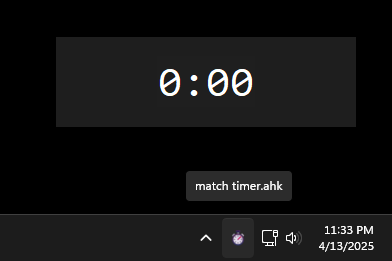

# Bloodpoint Farming Macros!
Here you can find macros that will help with the repetitive/tedious aspects of farming bloodpoints in Dead by Daylight!

> [!CAUTION]
> While these macros are not intended to give a competitive advantage, they are at odds with the BHVR Terms of Use. Use them at your own risk.

**NOTES:**
- All .ahk files require [Auto Hotkey v1.1](https://www.autohotkey.com/download/ahk-install.exe).
- You can easily edit each macro to customize them for non-standard configurations using notepad or ChatGPT.

## Skip Startup Screens
- Auto-clicks through the DBD startup screens.
- Times DBD startup.
- DBD must be fullscreen and visible.
- DBD does *not* need to be focused.

## Auto Click
- Auto-clicker for spending bloodpoints.
- F6 = Toggle ON / F7 = Toggle OFF

## Autospend
- F6 to spend BP using the [fast bloodweb tech](https://www.reddit.com/r/deadbydaylight/s/njguTZBODp).
- Experimental. May not work.
- Supports 1080p and 1440p resolutions.
- Run windowed at these resolutions if you need to.
- Disable filters if they interfere.
- Demo: https://youtu.be/duVNbdo9qLM

## Killer Shuffle
- Killer will repeatedly move forwards and backwards in place to allow survivors to get into chase (Spin blinding, Gen dancing, etc.).
- F2 = start dancing
- WASD = stop dancing

## FPS Switch
- Very quickly switches between 30 & 120 FPS.
- F3 = Set 30 FPS / F4 = Set 120 FPS
- UI scale must be 100%.

## FPS Switch (sleep)
- Slowly switches between 30 & 120 FPS.
- F3 = Set 30 FPS / F4 = Set 120 FPS
- This version of the FPS Switch macro can potentially work better for non-standard configurations (shaders, filters, etc).

## Killer Autohook
- Hooks a carried survivor when possible.
- Adds years of life to your keyboard's spacebar.
- UI scale must be 100%

## Hit Counter
- Press Ctrl+r to show a counter for the number of times you M1.
- Useful for killers to track the number of self-care hit rotations in Reactive builds.
- Disappears after 10 seconds of no hits.
- `Ctrl+` and `Ctrl-` to manually set (if necessary)
- `Ctrl+R` to reset to 0.

## Match Timer
- A simple match timer that resets when the black bars at the top/bottom of the screen fully disappear.
- Window is always on top and draggable.

## Abandon Match
- Uses the Abandon Match feature as soon as available.
- If that doesn't work, activate manually with Ctrl+Shift+A.
